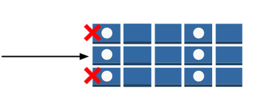
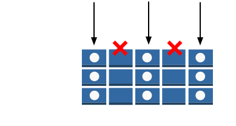
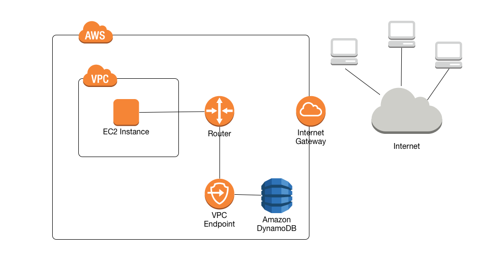

DynamoDB Test Cases

Last updated: October 18, 2019

Version: 0.2

**Document Control**

| Document Title      | Version | Author          | Summary               |
| ------------------- | ------- | --------------- | --------------------- |
| DynamoDB Test Cases | v0.1    | Jason Nelson    | Initial Draft         |
| DynamoDB Test Cases | v0.2    | Abdullah Garcia | API References Update |

# Table of Contents

[1. Executive Summary 4](#executive-summary)

[2. Test Cases 7](#test-cases)

[2.1 All DynamoDB tables are created with SSE enabled
7](#all-dynamodb-tables-are-created-with-sse-enabled)

[Scenario – User creates a DynamoDB table with SSE encryption enabled
7](#scenario-user-creates-a-dynamodb-table-with-sse-encryption-enabled)

[CloudTrail Event – Create a DynamoDB table with SSE enabled
9](#cloudtrail-event-create-a-dynamodb-table-with-sse-enabled)

[Scenario – User creates a DynamoDB table without SSE enabled
11](#scenario-user-creates-a-dynamodb-table-without-sse-enabled)

[CloudTrail Event - Create a DynamoDB table without SSE enabled
12](#cloudtrail-event---create-a-dynamodb-table-without-sse-enabled)

[2.2 All DynamoDB tables must remain encrypted at rest by SSE
14](#all-dynamodb-tables-must-remain-encrypted-at-rest-by-sse)

[Scenario – DescribeTable with SSE enabled
14](#scenario-describetable-with-sse-enabled)

[Scenario – DescribeTable without SSE enabled
15](#scenario-describetable-without-sse-enabled)

[2.3 Users are prohibited from creating DynamoDB tables without SSE
enabled
16](#users-are-prohibited-from-creating-dynamodb-tables-without-sse-enabled)

[Scenario – User creates a DynamoDB table with SSE encryption enabled
16](#scenario-user-creates-a-dynamodb-table-with-sse-encryption-enabled-1)

[CloudTrail Event – Create a DynamoDB table with SSE enabled
18](#cloudtrail-event-create-a-dynamodb-table-with-sse-enabled-1)

[Scenario – User creates a DynamoDB table without SSE enabled
20](#scenario-user-creates-a-dynamodb-table-without-sse-enabled-1)

[CloudTrail Event - Create a DynamoDB table without SSE enabled
21](#cloudtrail-event---create-a-dynamodb-table-without-sse-enabled-1)

[2.4 Be able to create an SSE protected DynamoDB table
23](#be-able-to-create-an-sse-protected-dynamodb-table)

[Scenario – User creates a DynamoDB table with SSE encryption enabled
23](#scenario-user-creates-a-dynamodb-table-with-sse-encryption-enabled-2)

[CloudTrail Event – Create a DynamoDB table with SSE enabled
25](#cloudtrail-event-create-a-dynamodb-table-with-sse-enabled-2)

[Scenario – User creates a DynamoDB table without SSE enabled
27](#scenario-user-creates-a-dynamodb-table-without-sse-enabled-2)

[CloudTrail Event - Create a DynamoDB table without SSE enabled
28](#cloudtrail-event---create-a-dynamodb-table-without-sse-enabled-2)

[2.5 Users can only connect to DynamoDB through HTTPS
30](#users-can-only-connect-to-dynamodb-through-https)

[Scenario – User access DynamoDB over HTTPS endpoint
30](#scenario-user-access-dynamodb-over-https-endpoint)

[Scenario – User attempts access DynamoDB over HTTP endpoint
30](#scenario-user-attempts-access-dynamodb-over-http-endpoint)

[2.6 Allow AWS Services to inherit an IAM role to access DynamoDB
32](#allow-aws-services-to-inherit-an-iam-role-to-access-dynamodb)

[Scenario – Lambda is granted permission to DynamoDB
32](#scenario-lambda-is-granted-permission-to-dynamodb)

[2.7 Update IAM policy to restrict access to a partition key or
attribute in a DynamoDB table
33](#update-iam-policy-to-restrict-access-to-a-partition-key-or-attribute-in-a-dynamodb-table)

[Scenario – IAM policy that restricts access to a specific partition key
in a DynamoDB table
34](#scenario-iam-policy-that-restricts-access-to-a-specific-partition-key-in-a-dynamodb-table)

[Scenario – IAM policy that restricts access to a specific attribute in
a DynamoDB table
35](#scenario-iam-policy-that-restricts-access-to-a-specific-attribute-in-a-dynamodb-table)

[2.8 DynamoDB is only accessible via a VPC Endpoint
37](#dynamodb-is-only-accessible-via-a-vpc-endpoint)

[Scenario – A user creates a VPC endpoint
38](#scenario-a-user-creates-a-vpc-endpoint)

[CloudTrail Event – A user makes a request to DynamoDB across a VPC
endpoint
39](#cloudtrail-event-a-user-makes-a-request-to-dynamodb-across-a-vpc-endpoint)

[CloudTrail Event – A user makes a request to DynamoDB across the public
internet
40](#cloudtrail-event-a-user-makes-a-request-to-dynamodb-across-the-public-internet)

[2.9 All DynamoDB API calls are recorded in CloudTrail
41](#all-dynamodb-api-calls-are-recorded-in-cloudtrail)

[2.10 Restrict DynamoDB access through IAM roles
43](#restrict-dynamodb-access-through-iam-roles)

[Scenario – IAM policy that restricts access to Read-Only on a specific
DynamoDB table
43](#scenario-iam-policy-that-restricts-access-to-read-only-on-a-specific-dynamodb-table)

# Executive Summary

Amazon DynamoDB is a fully managed NoSQL database service that provides
fast and predictable performance with seamless scalability. DynamoDB
lets you offload the administrative burdens of operating and scaling a
distributed database, so that you don't have to worry about hardware
provisioning, setup and configuration, replication, software patching,
or cluster scaling. Also, DynamoDB offers encryption at rest, which
eliminates the operational burden and complexity involved in protecting
sensitive data.

With DynamoDB, you can create database tables that can store and
retrieve any amount of data and serve any level of request traffic. You
can scale up or scale down your tables' throughput capacity without
downtime or performance degradation and use the AWS Management Console
to monitor resource utilization and performance metrics.

Amazon DynamoDB provides on-demand backup capability. It allows you to
create full backups of your tables for long-term retention and archival
for regulatory compliance needs. DynamoDB allows you to delete expired
items from tables automatically to help you reduce storage usage and the
cost of storing data that is no longer relevant.

DynamoDB automatically spreads the data and traffic for your tables over
a sufficient number of servers to handle your throughput and storage
requirements, while maintaining consistent and fast performance. All of
your data is stored on solid state disks (SSDs) and automatically
replicated across multiple Availability Zones in an AWS region,
providing built-in high availability and data durability. You can use
global tables to keep DynamoDB tables in sync across AWS Regions.

Amazon DynamoDB integrates with AWS Identity and Access Management (IAM)
so that you can specify which Amazon DynamoDB actions a user in your AWS
account can perform. Every AWS resource is owned by an AWS account, and
permissions to create or access a resource are governed by permissions
policies. An account administrator can attach permissions policies to
IAM identities (that is, users, groups, and roles), and some services
(such as AWS Lambda) also support attaching permissions policies to
resources. When granting permissions, you decide who is getting the
permissions, the resources they get permissions for, and the specific
actions that you want to allow on those resources.

In DynamoDB, the primary resources are *tables*. DynamoDB also supports
additional resource types, *indexes* and *streams*. However, you can
create indexes and streams only in the context of an existing DynamoDB
table. These are referred to as *subresources*. These resources and
subresources have unique Amazon Resource Names (ARNs) associated with
them.

For security reasons, many AWS customers run their applications within
an Amazon Virtual Private Cloud environment (Amazon VPC). With Amazon
VPC, you can launch Amazon EC2 instances into a virtual private cloud,
which is logically isolated from other networks—including the public
Internet. With an Amazon VPC, you have control over its IP address
range, subnets, routing tables, network gateways, and security settings.

In order to access the public Internet, your VPC must have an Internet
gateway—a virtual router that connects your VPC to the Internet. This
allows applications running on Amazon EC2 in your VPC to access Internet
resources, such as Amazon DynamoDB. By default, communications to and
from DynamoDB use the HTTPS protocol, which protects network traffic by
using SSL/TLS encryption.

Many customers have legitimate privacy and security concerns about
sending and receiving data across the public Internet. Customers can
address these concerns by using a virtual private network (VPN) to route
all DynamoDB network traffic through the customer's own corporate
network infrastructure. However, this approach can introduce bandwidth
and availability challenges.

VPC endpoints for DynamoDB can alleviate these challenges. A *VPC
endpoint* for DynamoDB enables Amazon EC2 instances in your VPC to use
their private IP addresses to access DynamoDB with no exposure to the
public Internet. Your EC2 instances do not require public IP addresses,
and you do not need an Internet gateway, a NAT device, or a virtual
private gateway in your VPC. You use endpoint policies to control access
to DynamoDB. Traffic between your VPC and the AWS service does not leave
the Amazon network.

When you create a VPC endpoint for DynamoDB, any requests to a DynamoDB
endpoint within the region are routed to a private DynamoDB endpoint
within the Amazon network. You do not need to modify your applications
running on EC2 instances in your VPC—the endpoint name remains the same,
but the route to DynamoDB stays entirely within the Amazon network and
does not access the public Internet.

DynamoDB is integrated with AWS CloudTrail, a service that captures
low-level API requests made by or on behalf of DynamoDB in your AWS
account and delivers the log files to an Amazon S3 bucket that you
specify. CloudTrail captures calls made from the DynamoDB console or
from the DynamoDB low-level API. Using the information collected by
CloudTrail, you can determine what request was made to DynamoDB, the
source IP address from which the request was made, who made the request,
when it was made, and so on. CloudTrail logging is automatically enabled
in your AWS account.

When CloudTrail logging is enabled in your AWS account any low-level API
calls made to DynamoDB actions are tracked in log files. DynamoDB
records are written together with other AWS service records in a log
file. CloudTrail determines when to create and write to a new file based
on a time period and file size.

The following API actions are supported:

**Amazon DynamoDB**

  - BatchGetItem

  - BatchWriteItem

  - CreateBackup

  - CreateGlobalTable

  - CreateTable

  - DeleteBackup

  - DeleteItem

  - DeleteTable

  - DescribeBackup

  - DescribeContinuousBackups

  - DescribeEndpoints

  - DescribeGlobalTable

  - DescribeGlobalTableSettings

  - DescribeLimits

  - DescribeTable

  - DescribeTimeToLive

  - GetItem

  - ListBackups

  - ListGlobalTables

  - ListTables

  - ListTagsOfResource

  - PutItem

  - Query

  - RestoreTableFromBackup

  - RestoreTableToPointInTime

  - Scan

  - TagResource

  - TransactGetItems

  - TransactWriteItems

  - UntagResource

  - UpdateContinuousBackups

  - UpdateGlobalTable

  - UpdateGlobalTableSettings

  - UpdateItem

  - UpdateTable

  - UpdateTimeToLive

**DynamoDB Streams**

  - DescribeStream

  - GetRecords

  - GetShardIterator

  - ListStreams

**DynamoDB Accelerator (DAX)**

  - CreateCluster

  - CreateParameterGroup

  - CreateSubnetGroup

  - DecreaseReplicationFactor

  - DeleteCluster

  - DeleteParameterGroup

  - DeleteSubnetGroup

  - DescribeClusters

  - DescribeDefaultParameters

  - DescribeEvents

  - DescribeParameterGroups

  - DescribeParameters

  - DescribeSubnetGroups

  - IncreaseReplicationFactor

  - ListTags

  - RebootNode

  - TagResource

  - UntagResource

  - UpdateCluster

  - UpdateParameterGroup

  - UpdateSubnetGroup

Every log entry contains information about who generated the request.
The user identity information in the log helps you determine whether the
request was made with root or IAM user credentials, with temporary
security credentials for a role or federated user, or by another AWS
service.

# Test Cases

Amazon DynamoDB Test Cases to assist with security baselining

## All DynamoDB tables are created with SSE enabled 

| **As A**          | **I Want to**                                                | **So that**                                                        |
| ----------------- | ------------------------------------------------------------ | ------------------------------------------------------------------ |
| Security Engineer | ensure that all DynamoDB tables are created with SSE enabled | All data contained in the data store service are encrypted at rest |

Amazon DynamoDB offers fully managed encryption at rest. DynamoDB
encryption at rest provides enhanced security by encrypting your data at
rest using an AWS Key Management Service (AWS KMS) managed encryption
key for DynamoDB. This functionality eliminates the operational burden
and complexity involved in protecting sensitive data.

Encryption at rest can be enabled only when you are creating a new
DynamoDB table. Currently, you can't enable encryption at rest on an
existing table. After encryption at rest is enabled, it can't be
disabled.

Currently, encryption at rest is supported in the following AWS Regions:

  - US East (Ohio)

  - US East (N. Virginia)

  - US West (Oregon)

  - US West (N. California)

  - Canada (Central)

  - South America (São Paulo)

  - EU (Ireland)

  - EU (London)

  - EU (Frankfurt)

  - Asia Pacific (Mumbai)

  - Asia Pacific (Tokyo)

  - Asia Pacific (Seoul)

  - Asia Pacific (Singapore)

  - Asia Pacific (Sydney)

### Scenario – User creates a DynamoDB table with SSE encryption enabled

You can enable SSE encryption only during the creation of a DynamoDB
table. It can be enabled in the console during creation or through the
AWS CLI –sse-specification subcommand.

AWS CLI Command

Result – Success

### CloudTrail Event – Create a DynamoDB table with SSE enabled

### Scenario – User creates a DynamoDB table without SSE enabled

AWS CLI Command

Result – Success

### CloudTrail Event - Create a DynamoDB table without SSE enabled

## All DynamoDB tables must remain encrypted at rest by SSE

| **As A**          | **I Want to**                                                   | **So that**                                                        |
| ----------------- | --------------------------------------------------------------- | ------------------------------------------------------------------ |
| Security Engineer | ensure that all DynamoDB tables remain encrypted at rest by SSE | all data contained in the data store service are encrypted at rest |

You can check SSE settings on a table by issuing the DescribeTable api.
The DescribeTable api returns information about the table, including the
current status of the table, when it was created, the primary key
schema, and any indexes on the table.

### Scenario – DescribeTable with SSE enabled

A user issues the describe-table command and receives a response that
shows SSE enabled.

AWS CLI Command

Result – SSE Enabled

### Scenario – DescribeTable without SSE enabled

A user issues the describe-table command and receives a response but
there is no parameter for SSEDescription. This indicates that SSE is not
enabled

AWS CLI Command

Result – SSE Enabled

## Users are prohibited from creating DynamoDB tables without SSE enabled 

| **As A**          | **I Want to**                                                        | **So that**                                                        |
| ----------------- | -------------------------------------------------------------------- | ------------------------------------------------------------------ |
| Security Engineer | prohibit users creating DynamoDB tables that do not have SSE enabled | all data contained in the data store service are encrypted at rest |

Amazon DynamoDB offers fully managed encryption at rest. DynamoDB
encryption at rest provides enhanced security by encrypting your data at
rest using an AWS Key Management Service (AWS KMS) managed encryption
key for DynamoDB. This functionality eliminates the operational burden
and complexity involved in protecting sensitive data.

Encryption at rest can be enabled only when you are creating a new
DynamoDB table. Currently, you can't enable encryption at rest on an
existing table. After encryption at rest is enabled, it can't be
disabled.

Currently, encryption at rest is supported in the following AWS Regions:

  - US East (Ohio)

  - US East (N. Virginia)

  - US West (Oregon)

  - US West (N. California)

  - Canada (Central)

  - South America (São Paulo)

  - EU (Ireland)

  - EU (London)

  - EU (Frankfurt)

  - Asia Pacific (Mumbai)

  - Asia Pacific (Tokyo)

  - Asia Pacific (Seoul)

  - Asia Pacific (Singapore)

  - Asia Pacific (Sydney)

### Scenario – User creates a DynamoDB table with SSE encryption enabled

You can enable SSE encryption only during the creation of a DynamoDB
table. It can be enabled in the console during creation or through the
AWS CLI –sse-specification subcommand.

AWS CLI Command

Result – Success

### CloudTrail Event – Create a DynamoDB table with SSE enabled

### Scenario – User creates a DynamoDB table without SSE enabled

AWS CLI Command

Result – Success

### CloudTrail Event - Create a DynamoDB table without SSE enabled

## Be able to create an SSE protected DynamoDB table

| **As A**            | **I Want to**                                     | **So that**                                                                          |
| ------------------- | ------------------------------------------------- | ------------------------------------------------------------------------------------ |
| Solutions Developer | be able to create an SSE protected DynamoDB table | I can store data protected by date-at-rest encryption, using the service default key |

Amazon DynamoDB offers fully managed encryption at rest. DynamoDB
encryption at rest provides enhanced security by encrypting your data at
rest using an AWS Key Management Service (AWS KMS) managed encryption
key for DynamoDB. This functionality eliminates the operational burden
and complexity involved in protecting sensitive data.

Encryption at rest can be enabled only when you are creating a new
DynamoDB table. Currently, you can't enable encryption at rest on an
existing table. After encryption at rest is enabled, it can't be
disabled.

Currently, encryption at rest is supported in the following AWS Regions:

  - US East (Ohio)

  - US East (N. Virginia)

  - US West (Oregon)

  - US West (N. California)

  - Canada (Central)

  - South America (São Paulo)

  - EU (Ireland)

  - EU (London)

  - EU (Frankfurt)

  - Asia Pacific (Mumbai)

  - Asia Pacific (Tokyo)

  - Asia Pacific (Seoul)

  - Asia Pacific (Singapore)

  - Asia Pacific (Sydney)

### Scenario – User creates a DynamoDB table with SSE encryption enabled

You can enable SSE encryption only during the creation of a DynamoDB
table. It can be enabled in the console during creation or through the
AWS CLI –sse-specification subcommand.

AWS CLI Command

Result – Success

### CloudTrail Event – Create a DynamoDB table with SSE enabled

### Scenario – User creates a DynamoDB table without SSE enabled

AWS CLI Command

Result – Success

### CloudTrail Event - Create a DynamoDB table without SSE enabled

## Users can only connect to DynamoDB through HTTPS 

| **As A**          | **I Want to**                                                                                                       | **So that**                                                      |
| ----------------- | ------------------------------------------------------------------------------------------------------------------- | ---------------------------------------------------------------- |
| Security Engineer | prohibit applications and other users connecting to the DynamoDB service other than by the HTTPS protected endpoint | all data sent to and from the data store is encrypted in transit |

By default, communications to and from DynamoDB use the HTTPS protocol,
which protects network traffic by using SSL/TLS encryption. However, a
user can declare an HTTP endpoint which would allow HTTP traffic. You
can enforce HTTPS traffic by using IAM policies with a conditional
statement that enables SecureTransport, which enforces HTTPS traffic.

### Scenario – User access DynamoDB over HTTPS endpoint

A user has access to DynamoDB through an IAM policy that restricts
access to DynamoDB across HTTPS endpoints.

IAM Policy

AWS CLI Command

aws dynamodb list-tables --endpoint
https://dynamodb.us-east-1.amazonaws.com

Result – Success

{

"TableNames": \[

"test"\]

}

### Scenario – User attempts access DynamoDB over HTTP endpoint

A user has access to DynamoDB through an IAM policy that restricts
access to DynamoDB across HTTPS endpoints. They attempt to make a
request using an HTTP endpoint and receive an AccessDeniedException.

IAM Policy

AWS CLI Command

aws dynamodb list-tables --endpoint
http://dynamodb.us-east-1.amazonaws.com

Result – Success

An error occurred (AccessDeniedException) when calling the ListTables
operation: User: \<IAM Username\> is not authorized to perform:
dynamodb:ListTables on resource: \*

## Allow AWS Services to inherit an IAM role to access DynamoDB 

| **As A**            | **I Want to**                                                  | **So that**                                                      |
| ------------------- | -------------------------------------------------------------- | ---------------------------------------------------------------- |
| Solutions Developer | pass a role to AWS services to connect to the DynamoDB service | all data sent to and from the data store is encrypted in transit |

Every AWS resource is owned by an AWS account, and permissions to create
or access a resource are governed by permissions policies. An account
administrator can attach permissions policies to IAM identities (that
is, users, groups, and roles), and some services (such as AWS Lambda)
also support attaching permissions policies to resources. When granting
permissions, you decide who is getting the permissions, the resources
they get permissions for, and the specific actions that you want to
allow on those resources.

When you enable DynamoDB Streams on a table, it captures information
about every modification to data items in the table. In some cases, you
might want to prevent an application from reading data from a DynamoDB
table, while still allowing access to that table's stream. For example,
you can configure AWS Lambda to poll the stream and invoke a Lambda
function when item updates are detected, and then perform additional
processing.

If you want certain actions to be performed based on new events in a
DynamoDB stream, you can write an AWS Lambda function that is triggered
by these new events. A Lambda function such as this needs permission to
read data from the DynamoDB stream. To grant permissions to Lambda, you
use the permissions policy that is associated with the Lambda function's
IAM role (execution role), which you specify when you create the Lambda
function.

### Scenario – Lambda is granted permission to DynamoDB

In this scenario we have an IAM policy that allows Read actions to a
particular DynamoDB stream.

IAM Policy

## Update IAM policy to restrict access to a partition key or attribute in a DynamoDB table

| **As A**            | **I Want to**                                                                                                                              | **So that**                                                                                                            |
| ------------------- | ------------------------------------------------------------------------------------------------------------------------------------------ | ---------------------------------------------------------------------------------------------------------------------- |
| Solutions Developer | update IAM policy to restrict/permit access to a specific partition key or attribute in a DynamoDB table based on application requirements | my applications can be given access only to the data they need access to, and to meet security compliance requirements |

In DynamoDB, you have the option to specify conditions when granting
permissions using an IAM policy. For example, you can grant permissions
to allow users read-only access to certain items and attributes in a
table or a secondary index or allow users write-only access to certain
attributes in a table, based upon the identity of that user.

In DynamoDB, you can specify conditions in an IAM policy using condition
keys. In addition to controlling access to DynamoDB API actions, you can
also control access to individual data items and attributes. For
example, you can do the following:

  - Grant permissions on a table but restrict access to specific items
    in that table based on certain primary key values.

  - Hide information so that only a subset of attributes are visible to
    the user.

To implement this kind of fine-grained access control, you write an IAM
permissions policy that specifies conditions for accessing security
credentials and the associated permissions. You then apply the policy to
IAM users, groups, or roles that you create. Your IAM policy can
restrict access to individual items in a table, access to the attributes
in those items, or both at the same time.

Unlike SQL and other relational databases, DynamoDB is schemaless and
sometimes referred to as NoSQL. Instead of the relation model, DynamoDB
uses a key-value pair for data storage. So instead of a table being
organized in to rows and columns, every table will have a primary key
that uniquely identifies each data item, not there are no similar
constraints on other non-ley attributes. This means that DynamoDB can
manage structured of semi-structured data such as JSON documents.

### Scenario – IAM policy that restricts access to a specific partition key in a DynamoDB table

IAM policies can restrict access to a specific primary key in a DynamoDB
table by using the condition key dynamodb:LeadingKeys. This represents
the first key attribute of a table—in other words, the partition key.
Note that the key name LeadingKeys is plural, even if the key is used
with single-item actions. In addition, note that you must use the
ForAllValues modifier when using LeadingKeys in a condition.

In this scenario we have an IAM policy that limits access to the
partition key with a value of 2013. This is done by using the condition
of "dynamodb:LeadingKeys": "2013". The user is able to run a get-item
with key value pair of year=2013.

IAM policy

{

"Version": "2012-10-17",

"Statement": \[

{

"Sid": "VisualEditor0",

"Effect": "Allow",

"Action": \[

"dynamodb:DescribeReservedCapacityOfferings",

"dynamodb:ListGlobalTables",

"dynamodb:TagResource",

"dynamodb:UntagResource",

"dynamodb:ListTables",

"dynamodb:DescribeReservedCapacity",

"dynamodb:ListBackups",

"dynamodb:PurchaseReservedCapacityOfferings",

"dynamodb:ListTagsOfResource",

"dynamodb:DescribeTimeToLive",

"dynamodb:DescribeLimits",

"dynamodb:ListStreams"

\],

"Resource": "\*"

},

{

"Sid": "VisualEditor1",

"Effect": "Allow",

"Action": "dynamodb:\*",

"Resource": \<DynamoDB table Arn\>

"Condition": {

"ForAllValues:StringEquals": {

"dynamodb:LeadingKeys": "2013"

}

}

}

\]

}

CLI Command

aws dynamodb get-item --table-name Movies --key '{ "year": {"N": "2013"
}, "title": {"S":"Copperhead"} }' --query
'Item.\[year,title,info.M.plot\]'

Result – Success

\[

{

"N": "2013"

},

{

"S": "Copperhead"

},

{

"S": "An Upstate New York family is torn apart during the American Civil
War."

}

\]

### Scenario – IAM policy that restricts access to a specific attribute in a DynamoDB table

In this scenario we have an IAM policy that limits specific read
permission to the “year” and”title” attributes on a particular DynamoDB
table.

IAM policy

{

"Version": "2012-10-17",

"Statement": \[ {

"Sid": "VisualEditor0",

"Effect": "Allow",

"Action": \[

"dynamodb:BatchGetItem",

"dynamodb:GetItem",

"dynamodb:Scan",

"dynamodb:Query"

\],

"Resource": \<DynamoDB Table arn\>

"Condition": {

"ForAllValues:StringEquals": {

"dynamodb:Attributes": \[

"year",

"title"

\]

}

}

}

\]

}

CLI Command

aws dynamodb get-item --table-name Movies --key '{ "year": {"N": "2013"
}, "title": {"S":"Copperhead"} }' --query
'Item.\[year,title,info.M.plot\]'

Result – Success

\[

{

"N": "2013"

},

{

"S": "Copperhead"

},

{

"S": "An Upstate New York family is torn apart during the American Civil
War."

}

\]

## DynamoDB is only accessible via a VPC Endpoint

| **As A**          | **I Want to**                                                          | **So that**                                  |
| ----------------- | ---------------------------------------------------------------------- | -------------------------------------------- |
| Security Engineer | ensure that the DynamoDB service is only accessible via a VPC Endpoint | data is not transmitted outside the host VPC |

Many AWS customers run their applications within a Amazon Virtual
Private Cloud (VPC) for security or isolation reasons. Previously, if
you wanted your EC2 instances in your VPC to be able to access DynamoDB,
you had two options. You could use an Internet Gateway (with a NAT
Gateway or assigning your instances public IPs) or you could route all
of your traffic to your local infrastructure via VPN or AWS Direct
Connect and then back to DynamoDB. Both of these solutions had security
and throughput implications and it could be difficult to restrict access
to just DynamoDB

VPC endpoints for DynamoDB can alleviate these challenges. A *VPC
endpoint* for DynamoDB enables Amazon EC2 instances in your VPC to use
their private IP addresses to access DynamoDB with no exposure to the
public Internet. Your EC2 instances do not require public IP addresses,
and you do not need an Internet gateway, a NAT device, or a virtual
private gateway in your VPC. You use endpoint policies to control access
to DynamoDB. Traffic between your VPC and the AWS service does not leave
the Amazon network.

When you create a VPC endpoint for DynamoDB, any requests to a DynamoDB
endpoint within the region (for
example, *dynamodb.us-west-2.amazonaws.com*) are routed to a private
DynamoDB endpoint within the Amazon network. You do not need to modify
your applications running on EC2 instances in your VPC—the endpoint name
remains the same, but the route to DynamoDB stays entirely within the
Amazon network and does not access the public Internet.

The following diagram shows how an EC2 instance in a VPC can use a VPC
endpoint to access DynamoDB.

### Scenario – A user creates a VPC endpoint

VPC endpoints can be created in the AWS console, AWS CLI or SDK
libraries using the CreateVPCEndpoint api. When creating a VPC endpoint
you will need to declare the service-name of
com.amazonaws.\<region\>.dynamodb to associate the traversal of traffic
to DynamoDB. You can then add the VPC Endpoint to routing tables to
direct traffic.

AWS CLI Command

Result – Success

### CloudTrail Event – A user makes a request to DynamoDB across a VPC endpoint

When a user makes a request to DynamoDB across a VPC endpoint the
sourceIPAddress will be recorded as an internal private IP address from
within the VPC. In addition there will also be a field for
vpcEndpointId.

{

"eventVersion": "1.05",

"userIdentity": {

"type": "IAMUser",

"principalId": \<Principal Id\>

"arn": \<IAM User arn\>

"accountId": \<Account Id\>

"accessKeyId": \<Access Key Id\>

"userName": \<IAM Username\>

},

"eventTime": "2018-06-13T13:07:26Z",

"eventSource": "dynamodb.amazonaws.com",

"eventName": "DescribeTable",

"awsRegion": "us-east-1",

"sourceIPAddress": \<Private IP Address\>

"userAgent": "aws-cli/1.15.27 Python/2.7.13
Linux/4.9.81-35.56.amzn1.x86\_64 botocore/1.10.27",

"requestParameters": {

"tableName": "test"

},

"responseElements": null,

"requestID": "CS18VMCFT9V4JJT0OALSJDTUIJVV4KQNSO5AEMVJF66Q9ASUAAJG",

"eventID": "62264ae9-7bdf-4dee-8c0b-607fa6f395f9",

"eventType": "AwsApiCall",

"apiVersion": "2012-08-10",

"recipientAccountId": \<Account Id\>

"vpcEndpointId": \<VPC Endpoint Id\>

}

### CloudTrail Event – A user makes a request to DynamoDB across the public internet 

When a user makes a request to DynamoDB across the public internet, the
sourceIPAddress will be recorded as the public IP address of the
requestor.

{

"eventVersion": "1.05",

"userIdentity": {

"type": "IAMUser",

"principalId": \<Principal Id\>,

"arn": \<IAM user arn\>

"accountId": \<Account Id\>

"accessKeyId": \<Access Key Id\>,

"userName": \<IAM Username\>

},

"eventTime": "2018-06-12T12:58:16Z",

"eventSource": "dynamodb.amazonaws.com",

"eventName": "DescribeTable",

"awsRegion": "us-east-1",

"sourceIPAddress": \<Public IP Address\>

"userAgent": "aws-cli/1.15.27 Python/2.7.13
Linux/4.9.81-35.56.amzn1.x86\_64 botocore/1.10.27",

"requestParameters": {

"tableName": "test2"

},

"responseElements": null,

"requestID": "61ROBTDVLN1M9U4HFAEPEIP8NJVV4KQNSO5AEMVJF66Q9ASUAAJG",

"eventID": "9b743588-8e0c-4da9-b1f3-55c92adae7da",

"eventType": "AwsApiCall",

"apiVersion": "2012-08-10",

"recipientAccountId": \<Account Id\>

}

## All DynamoDB API calls are recorded in CloudTrail

| **As A**          | **I Want to**                                                               | **So that**                                                |
| ----------------- | --------------------------------------------------------------------------- | ---------------------------------------------------------- |
| Security Engineer | ensure that all API calls relating to DynamoDB are recorded in a CloudTrail | changes to any DynamoDB table can be audited and monitored |

DynamoDB is integrated with AWS CloudTrail, a service that captures
low-level API requests made by or on behalf of DynamoDB in your AWS
account and delivers the log files to an Amazon S3 bucket that you
specify. CloudTrail captures calls made from the DynamoDB console or
from the DynamoDB low-level API. Using the information collected by
CloudTrail, you can determine what request was made to DynamoDB, the
source IP address from which the request was made, who made the request,
when it was made, and so on. CloudTrail logging is automatically enabled
in your AWS account.

When CloudTrail logging is enabled in your AWS account any low-level API
calls made to DynamoDB actions are tracked in log files. DynamoDB
records are written together with other AWS service records in a log
file. CloudTrail determines when to create and write to a new file based
on a time period and file size.

The following API actions are supported:

**Amazon DynamoDB**

  - CreateBackup

  - CreateGlobalTable

  - CreateTable

  - DeleteBackup

  - DeleteTable

  - DescribeBackup

  - DescribeContinuousBackups

  - DescribeGlobalTable

  - DescribeLimits

  - DescribeTable

  - DescribeTimeToLive

  - ListBackups

  - ListTables

  - ListTagsOfResource

  - ListGlobalTables

  - RestoreTableFromBackup

  - TagResource

  - UntagResource

  - UpdateGlobalTable

  - UpdateTable

  - UpdateTimeToLive

  - DescribeReservedCapacity

  - DescribeReservedCapacityOfferings

  - PurchaseReservedCapacityOfferings

**DynamoDB Streams**

  - DescribeStream

  - ListStreams

**DynamoDB Accelerator (DAX)**

  - CreateCluster

  - CreateParameterGroup

  - CreateSubnetGroup

  - DecreaseReplicationFactor

  - DeleteCluster

  - DeleteParameterGroup

  - DeleteSubnetGroup

  - DescribeClusters

  - DescribeDefaultParameters

  - DescribeEvents

  - DescribeParameterGroups

  - DescribeParameters

  - DescribeSubnetGroups

  - IncreaseReplicationFactor

  - ListTags

  - RebootNode

  - TagResource

  - UntagResource

  - UpdateCluster

  - UpdateParameterGroup

  - UpdateSubnetGroup

Every log entry contains information about who generated the request.
The user identity information in the log helps you determine whether the
request was made with root or IAM user credentials, with temporary
security credentials for a role or federated user, or by another AWS
service.

## Restrict DynamoDB access through IAM roles 

| **As A**          | **I Want to**                                                     | **So that**                                                  |
| ----------------- | ----------------------------------------------------------------- | ------------------------------------------------------------ |
| Security Engineer | restrict the roles who have access to read/write/update the table | maintain the principle of least privilege within the account |

Every AWS resource is owned by an AWS account, and permissions to create
or access a resource are governed by permissions policies. An account
administrator can attach permissions policies to IAM identities (that
is, users, groups, and roles), and some services (such as AWS Lambda)
also support attaching permissions policies to resources. When granting
permissions, you decide who is getting the permissions, the resources
they get permissions for, and the specific actions that you want to
allow on those resources.

Using IAM policies you can limit access to specific actions and specific
DynamoDB tables. Limiting actions to a specific DynamoDB table can be
done by specifying the DynamoDB table arn in the “Resource” section of
the IAM policy.

### Scenario – IAM policy that restricts access to Read-Only on a specific DynamoDB table

In this scenario we have a policy that Allows only Read permission to a
particular DynamoDB table. The user is able to retrieve results running
get-item on the table “Movies” but receives an AccessDeniedError
response on the “Movies2” table.

IAM policy

{

"Version": "2012-10-17",

"Statement": \[

{

"Sid": "VisualEditor0",

"Effect": "Allow",

"Action": \[

"dynamodb:BatchGetItem",

"dynamodb:DescribeGlobalTableSettings",

"dynamodb:DescribeTable",

"dynamodb:DescribeGlobalTable",

"dynamodb:GetShardIterator",

"dynamodb:GetItem",

"dynamodb:DescribeContinuousBackups",

"dynamodb:Scan",

"dynamodb:DescribeStream",

"dynamodb:Query",

"dynamodb:DescribeBackup",

"dynamodb:GetRecords"

\],

"Resource": "arn:aws:dynamodb:us-east-1:637424961741:table/Movies"

},

{

"Sid": "VisualEditor1",

"Effect": "Allow",

"Action": \[

"dynamodb:DescribeReservedCapacityOfferings",

"dynamodb:DescribeReservedCapacity",

"dynamodb:ListTagsOfResource",

"dynamodb:DescribeTimeToLive",

"dynamodb:DescribeLimits",

"dynamodb:ListStreams"

\],

"Resource": "\*"

}

\]

}

CLI Command – get-item on “Movies” table

aws dynamodb get-item --table-name Movies --key '{ "year": {"N": "2013"
}, "title": {"S":"Copperhead"} }' --query
'Item.\[year,title,info.M.plot\]'

Result – Success

\[

{

"N": "2013"

},

{

"S": "Copperhead"

},

{

"S": "An Upstate New York family is torn apart during the American Civil
War."

}

\]

CLI Command – get-item on “Movies2” table

aws dynamodb get-item --table-name Movies2 --key '{ "year": {"N": "2013"
}, "title": {"S":"Copperhead"} }' --query
'Item.\[year,title,info.M.plot\]'

Result – AccessDeniedError

An error occurred (AccessDeniedException) when calling the GetItem
operation: User: \<IAM User arn\> is not authorized to perform:
dynamodb:GetItem on resource: \<DynamoDB Table arn\>
