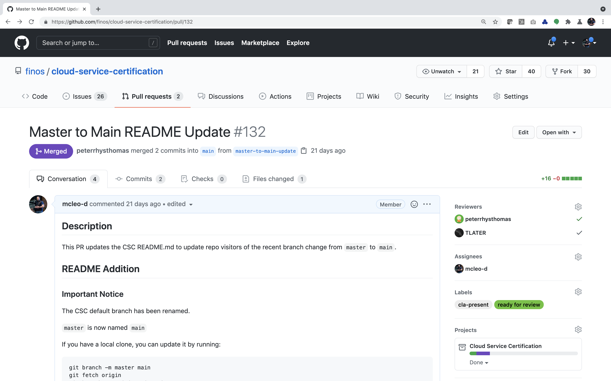
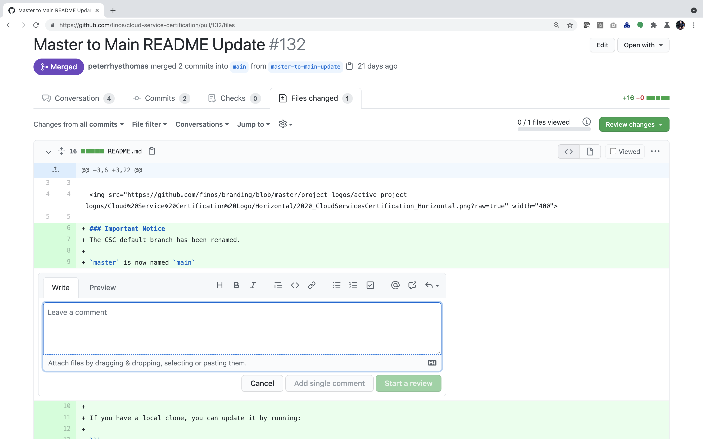

# Compliant Financial Infrastructure - Agile Workflow

The Agile Workflow for Compliant Financial Infrastructure falls into three main work streams which are overseen by Compliant Financial Infrastructure Project Maintainers and fulfilled by the Compliant Financial Infrastructure project team and wider FINOS community.

- [Agile Delivery of Prioritised Work Items](#agile)
- [Community Contributions and Pull Requests](#community)
- [Compliant Financial Infrastructure Asynchronous Pull Request and Code Reviews](#reviews)

## <a name="agile">Agile Delivery of Prioritised Work Items</a>

- Compliant Financial Infrastructure is an agile project with agreed agile ceremonies and a fixed sprint cadence. Example agile ceremonies include ...
  - Regular team stand-ups
  - Backlog grooming sessions
  - Pre-sprint planning
  - End of sprint demos
- Sprint cadence is  **monthly**, as agreed with the Compliant Financial Infrastructure project, with end of sprint sessions used for team demos and next-sprint planning.
- Middle of sprint Compliant Financial Infrastructure project meetings also act as stand-ups for team updates and any other discussions / demos to demonstrate completed work and as a forum for helping to remove team blockers.
- Volunteers from the Compliant Financial Infrastructure project form sub-teams around given tasks, epics and stories. Sub-teams own their own deliverables, and method of delivery, from start to finish.
- Teams self organise for completion of tasks within a given sprint(s), including appointing / aligning with the [Project Operations Manager](docs/open-roles/project-operations-manager.md) to help coordinate the team's delivery.
- Sub-teams swarm around their tasks, epics and stories with self-organised team sessions at the discretion and independent management of the team.
- Sub-teams collectively review and approve their own work, with final review and approval done at end of sprint demos, with the merge performed by the Compliant Financial Infrastructure Project Maintainers Team - @finos/cloud-cert-maintainers
- High level planning of the Compliant Financial Infrastructure roadmap happens quarterly, where the next quarter, half and year is reviewed and broken down into sprint priorities.
- Ad-hoc requests for help are made to the Compliant Financial Infrastructure Project Maintainers team which can be tagged using @finos/cloud-cert-maintainers 

## <a name="community">Community Contributions and Pull Requests</a>

- Pull Requests and Issues raised by the FINOS Community are automatically assigned to Compliant Financial Infrastructure Project Maintainers and allocated to the Compliant Financial Infrastructure project backlog for sprint prioritisation at the next scheduled sprint planning session.
- Critical Pull Requests and Issues are allocated to the Compliant Financial Infrastructure project team for immediate fulfilment at the discretion of the Compliant Financial Infrastructure Project Maintainers.

## <a name="reviews">Compliant Financial Infrastructure Asynchronous Pull Request and Code Reviews</a>

Compliant Financial Infrastructure openly encourages and invites asynchronous pull request and code reviews as part of its agile delivery workflow from the Compliant Financial Infrastructure and wider FINOS Community without direct invitation from Compliant Financial Infrastructure maintainers or contributors in order to increase pace and efficiency within the project.

### Reviewing Compliant Financial Infrastructure Pull Requests

Asynchronous reviews can take place in any Compliant Financial Infrastructure pull request that has a `ready for review` label assigned as illustrated below.

### Inline Code Reviews and Comments

Inline code reviews and comments are very much encouraged, invited and welcome in order to give context and instructions to the pull request contributor as demonstrated in the screenshot below.

### Reviewing Changes and Giving Feedback

Reviews and feedback from the Compliant Financial Infrastructure and wider FINOS Community are also welcome by submitting your review using the `Review Changes` feature as illustrated below.

By submitting asynchronous reviews you will be recognised as a Compliant Financial Infrastructure open source contributor and will be increasing the quality and pace of work being contributed into the FINOS Compliant Financial Infrastructure project and wider financial services industry.

### Receiving Community Feedback

Contributors to Compliant Financial Infrastructure are expected to take feedback from the wider FINOS and open source community into account during review cycles as well as feedback from regular Compliant Financial Infrastructure project contributors. This cycle of feedback creates an ecosystem of quality and learning that promotes an open and welcome community alongside a positive growth mindset.
